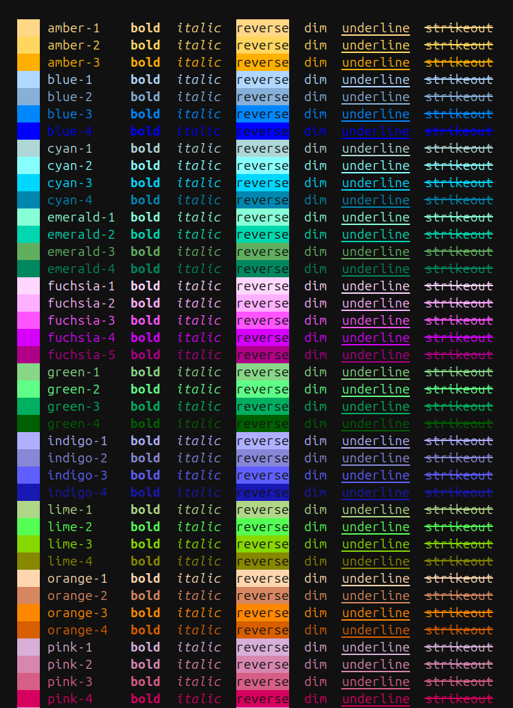
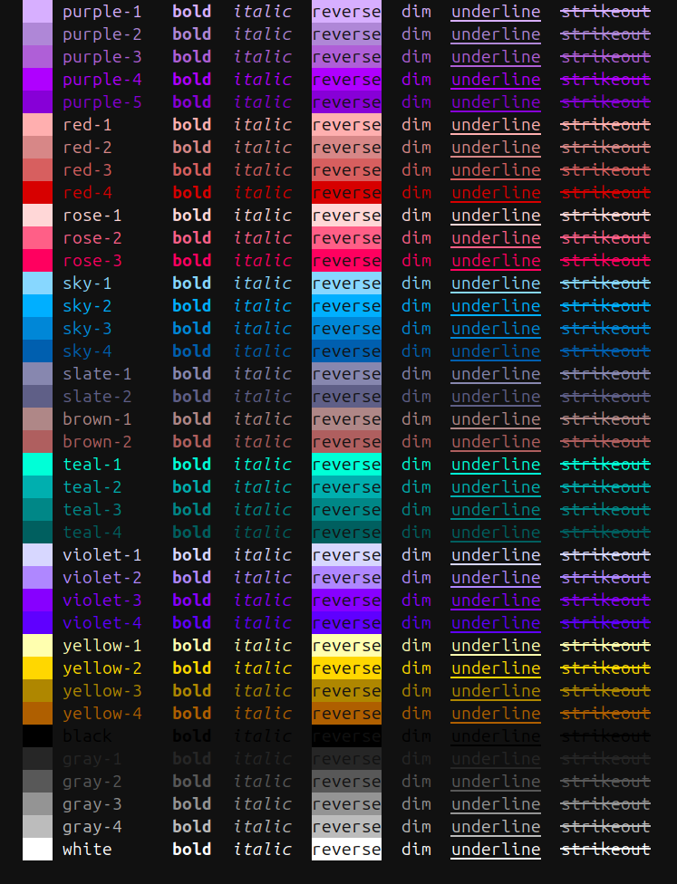

# Proper CLI

Proper CLI is a Python library for creating composable, nestable, and ridiculously good looking command-line-**user**-interfaces from simple classes.


## Features

- Made for interfacing **with humans**.
- Arbitrary nesting and composition of commands.
- Automatic help page generation
- No need to redeclare paramaters and options with decorators, just write Python methods
- The help of a command is its docstring, why make it more complex?


## Usage

Declare a class that inherits from `proper_cli.Cli`. Every method/attribute that does not starts with an underscore will be a command.

```python
from proper_cli import Cli

class Manage(Cli):
    def first(self, arg1, arg2=3):
        pass

    def second(self):
        pass

    def _not_a_command(self):
        pass
```

Then, instance that class and call it.

```python
# run.py
cli = Manage()

if __name__ == "__main__":
    cli()
```

The class dosctring will be printed at the beginning of the help page.

The arguments can be then passed by position:

```bash
python run.py first foo bar
```

or by name:

```bash
python run.py first -arg1 foo -arg2 bar
```

To pass a `True` use the name without a value, for a `False`, prepend the name of the argument with `no-`:

```bash
python run.py first -arg1 -no-arg2
```


### Subgroups

If an attribute is a subclass of `proper_cli.Cli`, it will be a subgroup:

```python
from proper_cli import Cli

class DBSub(Cli):
    def migrate(self):
        pass

class Manage(Cli):
    # A subgroup
    db = DBSub  # NOT `DBSub()`
```

### Context

You can pass any named argument as context to be used by your commands. This will be stored at the `_env` attribute.

Example:

```python
>>> cli = Manage(lorem="ipsum")
>>> print(cli._env)
{"lorem": "ipsum"}
```


## An example

The image at the top was autogenerated by running this example:

```python
# example.py
from proper_cli import Cli


class DBCli(Cli):
    """Database-related commands
    """

    def migrate(self, message):
        """Autogenerate a new revision file.

        This is an alias for "revision --autogenerate".

        Arguments:

        - message: Revision message

        """
        pass

    def branches(self):
        """Show all branches."""
        pass


class MyCli(Cli):
    """Welcome to Proper CLI 3
    """

    def new(self, path, quiet=False):
        """Creates a new Proper application at `path`.

        Arguments:

        - path: Where to create the new application.
        - quiet [False]: Supress all output.
        """
        pass

    def hello(count, name):
        """Simple program that greets NAME for a total of COUNT times."""
        pass

    # A subgroup!
    db = DBCli


cli = MyCli()

if __name__ == "__main__":
    cli()

```


## Coloring the Output

Whenever you output text, you can surround the text with tags to color its output
This is automatically enabled for the docstrings, but you can also have it by using `proper_cli.echo()` as a drop-in replacement of `print()`.

```python
# green text
echo("<color fg:green-3>foo</color>")

# bold green text
echo("<color fg:green-3 b>foo</color>")

# black text on a cyan background
echo("<color fg:cyan-1 r>foo</color>")

# italic underlined yellow text
echo("<color fg:yellow-2 iu>foo</color>")
```

The available styles are: **bold** (`b`), __italic__ (`i`), underline (`u`), strikeout (`s`), reverse (`r`), and dim (`d`)

The closing tag `</color>` revokes **all** formatting options established by the last opened tag.

Available colors are:





## Helpers

Beyond the CLI builder, proper_cli also includes some commonly-used helper functions

### `confirm(question, default=False, yes_choices=YES_CHOICES, no_choices=NO_CHOICES)`

Ask a yes/no question via and return their answer.

### `ask(question, default=None, alternatives=None)`

Ask a question via input() and return their answer.


## API

Everything below is importable directly from `proper_cli`.

### `Cli`

Base class for a command group. Subclass it; every method and attribute whose name does **not** start with an underscore becomes a command (or a subgroup, if it is itself a `Cli` subclass).

```python
Cli(*, parent="", indent="  ", initial_indent=" ", indent_start=0, show_params=True, **env)
```

- `parent`: Prefix shown in the generated usage line. Set automatically from `sys.argv[0]` when the instance is called.
- `indent`, `initial_indent`, `indent_start`: Control the indentation of the help page.
- `show_params`: When `False`, command arguments and options are omitted from the help page.
- `**env`: Arbitrary context, stored as the `_env` dict and inherited by subgroups.

Calling the instance (`cli()`) parses `sys.argv`, dispatches to the matching command or subgroup, and prints the help page when no command is given or `--help` is passed.

### `echo(*texts, sep=" ")`

Drop-in replacement for `print()` that renders `<color>` tags (see [Coloring the Output](#coloring-the-output)). Multiple arguments are joined with `sep`.

### `ask(question, default=None, alternatives="")`

Prompt for input via `input()` and return the answer. Returns `default` if the user enters nothing. `alternatives` is shown in brackets after the question (e.g. `"Y/n"`). The question is passed through `colorize()`, so it may contain `<color>` tags.

### `confirm(question, default=False, yes_choices=YES_CHOICES, no_choices=NO_CHOICES)`

Ask a yes/no question via `ask()` and return a `bool`. `YES_CHOICES` defaults to `("y", "yes", "t", "true", "on", "1")` and `NO_CHOICES` to `("n", "no", "f", "false", "off", "0")`.

### `colorize(text)`

Return `text` with every `<color …>…</color>` tag replaced by the matching ANSI escape codes. Does nothing — it simply strips the tags — unless the `$COLORTERM` environment variable is set. This is what `echo()` and the help pages use internally.

### `style(*, fg="", ul="", bold=False, italic=False, underline=False, strikeout=False, reverse=False, dim=False)`

Return the raw ANSI escape sequence for a foreground color (`fg`), an underline color (`ul`), and any combination of styles. `fg` and `ul` are keys of `COLORS`. Unlike `colorize()`, this always emits codes; pair it with `RESET` to end the formatting:

```python
from proper_cli import style, RESET

print(f"{style(fg='green-3', bold=True)}done{RESET}")
```

### `COLORS`

A `dict` mapping color names (e.g. `"green-3"`, `"amber-1"`) to their xterm-256 codes. These names are exactly the values accepted by the `fg:`/`ul:` tags and by `style()`. Run `proper_cli/colors.py` directly to preview the full palette in your terminal.

## FAQ

### Why don't just use optparse or argparse?

I find it too verbose.

### Why don't just use click?

ABecause this looks better and is easier to use and understand.

### Why don't just use...?

Because this library fits better my mental model. I hope it matches yours as well.
